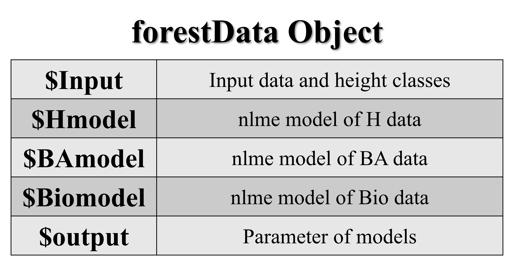

# <div align="center"><strong>Evaluating Forest Quality with Forestat</strong></div>

<p align="right"><strong>Forestat version:</strong> 1.0.0</p>
<p align="right"><strong>Date:</strong> 05/22/2023 </p>
<br>

*`Forestat`* is an R package developed based on the Institute of Forest Resource Information Techniques, Chinese Academy of Forestry's "Natural Forest Stand Quality Evaluation Method" [<sup>[1]</sup>](#citation). Its functions include the classification of natural forest stand height, establishment of tree height models, sectional area growth models, and stock growth models, as well as the calculation of forest actual productivity and potential productivity. Using *`Forestat`* can provide reliable basis for accurately improving forest quality.

<div align="center">

[English](README.en-US.md) | [简体中文](README.md)
<br>

</div>

## <div align="center">1 Overview</div>

*`Forestat`* package implements the classification of natural forest stand height, establishment of tree height models, sectional area growth models, and stock growth models, as well as the calculation of forest actual productivity and potential productivity. The tree height models can be constructed using Richard model, Logistic model, Korf model, Gompertz model, Weibull model, and Schumacher model, while the sectional area growth models and stock growth models can only be constructed using Richard model. *`forestat`* package relies on the data of natural forest stand, and a sample data is provided in the package.

### 1.1 *forestat* Flowchart

<div align="center">
  
  <p>Figure 1. Flowchart of <i>forestat</i></p>
</div>

### 1.2 R Packages Required by *forestat*

| **Package** | **Download Link**                          |
| ----------- | ------------------------------------------ |
| dplyr       | https://CRAN.R-project.org/package=dplyr   |
| ggplot2     | https://CRAN.R-project.org/package=ggplot2 |
| nlme        | https://CRAN.R-project.org/package=nlme    |

## <div align="center">2 Installation</div>

### 2.1 Install from CRAN or GitHub
To install *`forestat`* from [CRAN](https://CRAN.R-project.org/package=forestat) in R, use the following command:

```R
# Install required R packages
install.packages(c("dplyr", "ggplot2", "nlme"))

# Install forestat
install.packages("forest")
```

Alternatively, you can install *`forestat`* from [GitHub](https://github.com/caf-ifrit/forestat) in R using the following command:

```R
# Install required R packages
install.packages(c("dplyr", "ggplot2", "nlme"))

# Install devtools
install.packages("devtools")

# Install forestat
devtools::install_github("caf-ifrit/forestat/forestat")
```

### 2.2 Load *forestat*

```R
library(forestat)
```

## <div align="center">3 Quick Start</div>

This section demonstrates the complete steps to perform natural forest stand quality assessment quickly using the `forestData` sample data included in the package.

```R
# Load the forestData sample data included in the package
data("forestData")

# Build a model based on the forestData and return a forestData class object
forestData <- class.plot(forestData, model = "Richards",
                         interval = 5, number = 5, a = 19, b = 0.1, c = 0.8)

# Plot the scatter plot of stand basal area growth model
plot(forestData, model.type = "BA", plot.type = "Scatter",
     xlab = "AGE", ylab = "BA", legend.lab = "LastGroup",
     title = "Forest")

# Calculate the potential productivity of the forestData object
forestData <- potential.productivity(forestData)

# Calculate the actual productivity of the forestData object
forestData <- reality.productivity(forestData)

# Get the summary data of the forestData object
summary(forestData)
```

## <div align="center">4 Detailed Tutorial</div>

<details>
<summary style="font-size:21px;"><strong>4.1 Build Model</strong></summary>

<br>
<details>
<summary style="font-size:18px;"><strong>4.1.1 Custom Data</strong></summary>

To build an accurate model, good data is essential. The *`forestat`* package includes a cleaned sample data set that can be loaded and viewed using the following command:

```R
# Load the forestData sample data included in the package
data("forestData")

# Or read the forestat.csv sample data included in the package
forestData <- read.csv(system.file("extdata", "forestData.csv", package = "forestat"))

# Select the ID, code, AGE, H, S, BA, and Bio fields from the forestData sample data
# and view the first 6 rows of data
head(dplyr::select(forestData, ID, code, AGE, H, S, BA, Bio))

# Output
          ID code AGE    H        S       BA      Bio
1 6100005337    1  45 11.9 1508.468 50.13462 474.4957
2  410001607    1  42 16.7 1490.493 47.22381 444.5069
3 6100005337    1  35 11.0 1401.944 46.64877 435.8741
4 6100005337    1  40 12.8 1303.489 44.15220 415.9098
5  410001607    1  38 15.2 1350.941 42.37152 400.3925
6 6220002848    1  88 11.2 1631.235 50.43886 395.2503
```

Of course, you can also choose to load custom data:

```R
# Load custom data
forestData <- read.csv("/path/to/your/folder/your_file.csv")
```

The custom data is required to be in `csv` format, and the `ID (sample plot ID)`, `code (forest type code of sample plot)`, `AGE (the average age of the stand)`, and `H (the average height of the stand)` fields are required to build the `H Model` and plot the relevant example graphs.

The `S (stand density index)`, `BA (stand basal area)`, and `Bio (stand biomass)` fields are optional and are used to build the `BA Model` and `Bio Model`.

In the subsequent calculation of potential productivity and actual productivity, the `BA Model` and `Bio Model` are required. That is, if the custom data lacks the `S`, `BA`, and `Bio` fields, potential productivity and actual productivity cannot be calculated.

<div align="center">
  
  <p>Figure 2. Custom data format requirements</p>
</div>

</details>

<br>
<details>
<summary style="font-size:18px;"><strong>4.1.2 Build Stand Growth Model</strong></summary>
<div id="4.1.2"></div>

After the data is loaded, *`forestat`* will use the `class.plot()` function to build a stand growth model. If the custom data contains the `ID, code, AGE, H, S, BA, Bio` fields, the `H Model`, `BA Model`, and `Bio Model` will be built simultaneously. If only the `ID, code, AGE, H` fields are included, only the `H Model` will be built.

```R
# Use the Richards model to build a stand growth model
# interval = 5 indicates that the initial stand age interval for tree height classification is set to 5, and number = 5 indicates that the maximum number of initial tree height classifications is 5
# The initial parameters for fitting the model are a = 19, b = 0.1, and c = 0.8
forestData <- class.plot(forestData, model = "Richards",
                         interval = 5, number = 5, a = 19, b = 0.1, c = 0.8)
```

The `model` is the model used to build the `H Model` and can be selected from the `"Logistic"`, `"Richards"`, `"Korf"`, `"Gompertz"`, `"Weibull"`, and `"Schumacher"` models. The `BA Model` and `Bio Model` are built using the Richard model by default. `interval` is the initial stand age interval for tree height classification, and `number` is the maximum number of initial tree height classifications. `a, b, c` are the initial parameters for fitting the model. When fitting errors occur, try multiple initial parameters as attempts.

The result returned by the `class.plot()` function is the `forestData` object, which includes `Input (input data and tree height classification results)`, `H model (tree height model)`, `BA model (stand basal area growth model)`, `Bio model (stand biomass growth model)`, and `output (model parameters)`.

<div align="center">
  
  <p>Figure 3. Structure of the forestData object</p>
</div>

</details>

<br>
<details>
<summary style="font-size:18px;"><strong>4.1.3 Obtaining Summary Data</strong></summary>
<div id="4.1.3"></div>

To understand the establishment of the model, you can use the `summary(forestData)` function to obtain the summary data of the `forestData` object. The function returns the `summary.forestData` object and outputs the relevant data to the screen.

The first paragraph of the output is the summary of the input data, and the second, third, and fourth paragraphs are the parameters and concise reports of the `H model (tree height model)`, `BA model (basal area growth model)`, and `Bio model (stocking growth model)`, respectively.

```R
summary(forestData)
```

```R
# Output
# First paragraph
       H               S                 BA               Bio         
 Min.   : 2.00   Min.   :  15.94   Min.   : 0.3017   Min.   :  1.224  
 1st Qu.: 7.70   1st Qu.: 360.38   1st Qu.: 9.3241   1st Qu.: 53.233  
 Median : 9.40   Median : 557.25   Median :14.9777   Median : 95.002  
 Mean   : 9.83   Mean   : 583.88   Mean   :16.2648   Mean   :109.322  
 3rd Qu.:11.90   3rd Qu.: 764.38   3rd Qu.:21.6455   3rd Qu.:147.737  
 Max.   :17.70   Max.   :1772.26   Max.   :52.6455   Max.   :474.496  

# Second paragraph
Hmodel Parameters:

Nonlinear mixed-effects model fit by maximum likelihood
  Model: H ~ 1.3 + a * (1 - exp(-b * AGE))^c 
  Data: data 
       AIC      BIC    logLik
  2720.209 2746.159 -1355.105

Random effects:
 Formula: a ~ 1 | LASTGROUP
             a  Residual
StdDev: 3.6513 0.6616545

Fixed effects:  a + b + c ~ 1 
      Value Std.Error   DF   t-value p-value
a 11.226213 1.6509803 1319  6.799726       0
b  0.020457 0.0029541 1319  6.924853       0
c  0.370395 0.0228807 1319 16.188147       0
 Correlation: 
  a      b     
b -0.137       
c -0.122  0.949

Standardized Within-Group Residuals:
        Min          Q1         Med          Q3         Max 
-4.13170023 -0.75823758 -0.03968202  0.74727148  4.97834758 

Number of Observations: 1326
Number of Groups: 5 

Concise Parameter Report:
Model Coefficients:
       a1       a2       a3       a4       a5         b         c
 6.331338 8.578689 10.91438 13.61481 16.69184 0.0204566 0.3703953

Model Evaluations:
           pe      RMSE        R2       Var       TRE      AIC      BIC
 -0.001864527 0.6604061 0.9455896 0.4364619 0.4185215 2720.209 2746.159
    logLik
 -1355.105

Model Formulas:
                                       Func                  Spe
 model1:H ~ 1.3 + a * (1 - exp(-b * AGE))^c model1:pdDiag(a ~ 1)

# Third paragraph (similar data format to the second paragraph)
BAmodel Parameters:

# Omitted here
......

# Fourth paragraph (similar data format to the second paragraph)
Biomodel Parameters:

# Omitted here
......
```

</details>
</details>

<br>
<details>
<summary style="font-size:21px;"><strong>4.2 Plotting Graphs</strong></summary>

After constructing the stand growth model using the `class.plot()` function in [4.1.2](#4.1.2), you can use the `plot()` function to plot graphs.

The `model.type` parameter specifies the model used for plotting, which can be `H` (tree height model), `BA` (basal area growth model), or `Bio` (stocking growth model). The `plot.type` parameter specifies the type of plot, which can be `Curve` (curve plot), `Scatter_Curve` (scatter plot with curve), `residual` (residual plot), or `Scatter` (scatter plot). The `xlab`, `ylab`, `legend.lab`, and `title` parameters represent the x-axis label, y-axis label, legend, and title of the plot, respectively.

```R
# Plot the curve of the tree height model
plot(forestData,model.type="H",
     plot.type="Curve",
     xlab="Stand age (year)",ylab="Height (m)",legend.lab="Site class",
     title="Curve of the Oak and Broadleaf Tree Height Model")

# Plot the scatter plot of the basal area growth model
plot(forestData,model.type="BA",
     plot.type="Scatter",
     xlab="Stand age (year)",ylab="Height (m)",legend.lab="Site class",
     title="Scatter Plot of the Oak and Broadleaf Basal Area Growth Model")
```

The sample plots produced by different `plot.type` values are shown in Figure 4:

<div align="center">
  
  
  <p>Figure 4. Sample plots produced by different plot.type values</p>
</div>

</details>

<br>
<details>
<summary style="font-size:21px;"><strong>4.3 Calculate the Potential Productivity of Forest</strong></summary>

After constructing the stand growth model using the `class.plot()` function in [4.1.2](#4.1.2), the potential productivity of forests can be calculated using the `potential.productivity()` function. Before calculation, it is required that the `BA model` and `Bio model` have been established in the `forestData` object.

```R
forestData <- potential.productivity(forestData, code=1,
                                     age.min=5,age.max=150,
                                     left=0.05, right=100,
                                     e=1e-05, maxiter = 50) 
```

In the above code, the parameter `code` is the forest type code used for calculating the potential productivity. `age.min` and `age.max` represent the minimum and maximum age of the stand, and the calculation of potential productivity will be performed within this range. `left` and `right` are the initial parameters for fitting the model. When fitting fails, try multiple initial parameters. `e` is the precision of the fitting model. When the residual is less than `e`, the model is considered to have converged and the fitting is stopped. `maxiter` is the maximum number of times the model is fitted. When the number of fittings equals `maxiter`, the model is considered to have converged and the fitting is stopped.

<br>
<details>
<summary style="font-size:18px;"><strong>4.3.1 Description of Potential Productivity Output</strong></summary>

After the calculation, the following command can be used to view and output the results:

```R
library(dplyr)
forestData$potential.productivity %>% head(.)
```

```R
# Output
    Max_GI   Max_MI       N1       D1       S0       S1       G0       G1
1 3.432031 25.28960 7314.484 7.871238 1509.526 1637.494 32.16056 35.59259
2 2.905191 21.52146 6715.212 8.179387 1492.373 1598.908 32.37989 35.28508
3 2.518421 18.74017 6241.259 8.455917 1476.469 1567.516 32.53121 35.04963
4 2.222457 16.60206 5854.617 8.707564 1461.918 1541.273 32.64190 34.86436
5 1.988672 14.90643 5530.422 8.938955 1448.291 1518.519 32.71869 34.70736
6 1.799336 13.52842 5253.364 9.153519 1435.503 1498.419 32.77100 34.57033
        M0       M1 LASTGROUP AGE
1 196.4822 221.7718         1   5
2 199.6247 221.1461         1   6
3 202.0687 220.8089         1   7
4 204.0589 220.6610         1   8
5 205.6789 220.5854         1   9
6 207.0203 220.5487         1  10
```

The meanings of the fields in the output are as follows:

`Max_GI`: Maximum stand basal area

`Max_MI`: Maximum accumulated growth increment

`N1`: Number of trees in stand corresponding to potential growth increment

`D1`: Average stand diameter at potential growth increment

`S0`: Initial stand density index

`S1`: Optimal stand density index corresponding to potential growth increment

`G0`: Initial stand basal area per hectare

`G1`: Stand basal area per hectare corresponding to potential growth increment (1 year later)

`M0`: Initial stand volume per hectare

`M1`: Stand volume per hectare corresponding to potential growth increment

</details>
</details>

<br>
<details>
<summary style="font-size:20px;"><strong>4.4 Calculate the Actual Productivity of the Forest</strong></summary>

After constructing the stand growth model using the `class.plot()` function in [4.1.2](#4.1.2), the actual productivity of the forest can be calculated using the `reality.productivity()` function. Prior to the calculation, it is required that the `BA model` and `Bio model` have been established in the `forestData` object.

```R
forestData <- reality.productivity(forestData, 
                                   left=0.05, right=100)
```

Here, the `left` and `right` parameters are the initial parameters for fitting the model. When fitting errors occur, multiple attempts with different initial parameters can be made.

<br>
<details>
<summary style="font-size:18px;"><strong>4.4.1 Explanation of Reality Productivity Output Data</strong></summary>

After the calculation is completed, the following command can be used to view and output the results:

```R
library(dplyr)
forestData$reality.productivity %>% head(.)
```

```R
# Output
  code         ID AGE    H class0 LASTGROUP       BA        S      Bio
1    1 6100005337  45 11.9      4         4 50.13462 1508.468 474.4957
2    1  410001607  42 16.7      5         5 47.22381 1490.493 444.5069
3    1 6100005337  35 11.0      3         4 46.64877 1401.944 435.8741
4    1 6100005337  40 12.8      4         4 44.15220 1303.489 415.9098
5    1  410001607  38 15.2      5         5 42.37152 1350.941 400.3925
6    1 6220002848  88 11.2      3         3 50.43886 1631.235 395.2503
         BAI        VI
1 0.36488249 2.8670220
2 0.42883352 3.6013437
3 0.57137875 4.7817218
4 0.51822786 4.4346054
5 0.55925908 4.9739993
6 0.07333166 0.3845029
```

The meaning of each field in the output results is as follows:

`BAI`: Real productivity accumulation

`VI`: Potential productivity accumulation

</details>
</details>

<br>
<details>
<summary style="font-size:20px;"><strong>4.5 Details of Potential and Actual Productivity Data</strong></summary>

After obtaining the potential and actual productivity of the forest, you can use the `summary(forestData)` function to obtain the summary data of the `forestData` object. This function returns a `summary.forestData` object and outputs the relevant data to the screen.

The first four sections of the output were introduced in [4.1.3](#4.1.3), and the fifth section provides details of the potential and actual productivity data.

```R
summary(forestData)
```

```R
# Output
# First paragraph
       H               S                 BA               Bio         
 Min.   : 2.00   Min.   :  15.94   Min.   : 0.3017   Min.   :  1.224  
 
# Omitted here
......

# Fifth paragraph
     Max_GI           Max_MI      
 Min.   :0.1244   Min.   : 1.009  
 1st Qu.:0.1757   1st Qu.: 1.517  
 Median :0.2591   Median : 2.206  
 Mean   :0.4715   Mean   : 3.909  
 3rd Qu.:0.4878   3rd Qu.: 4.086  
 Max.   :3.9588   Max.   :33.858  
      BAI               VI       
 Min.   :0.0000   Min.   :0.000  
 1st Qu.:0.1388   1st Qu.:1.028  
 Median :0.2077   Median :1.597  
 Mean   :0.2353   Mean   :1.846  
 3rd Qu.:0.3116   3rd Qu.:2.558  
 Max.   :0.8562   Max.   :7.309  
```

</details>

## <div align="center">5 Citation</div>
<div id="citation"></div>

```txt
@article{lei2018methodology,
  title={Methodology and applications of site quality assessment based on potential mean annual increment.},
  author={Lei Xiangdong, Fu Liyong, Li Haikui, Li Yutang, Tang Shouzheng},
  journal={Scientia Silvae Sinicae},
  volume={54},
  number={12},
  pages={116-126},
  year={2018},
  publisher={The Chinese Society of Forestry}
}
```
