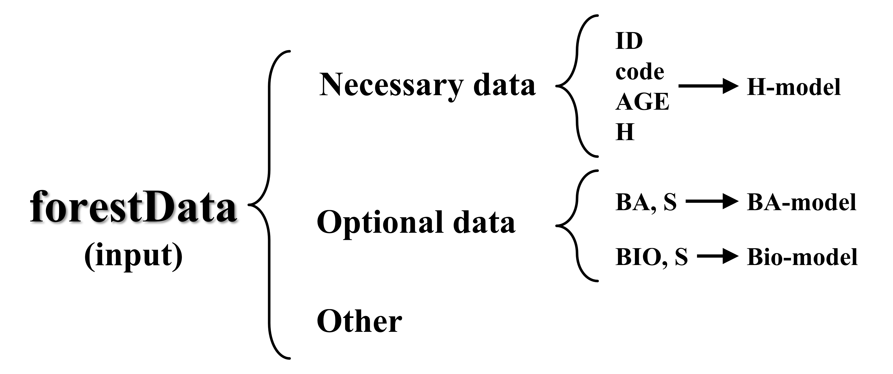

# <div align="center"><strong>Forest Carbon Sequestration and Potentiality Calculation</strong></div>

<p align="right"><strong>Forestat version:</strong> 1.0.2</p>
<p align="right"><strong>Date:</strong> 07/05/2023 </p>
<br>

*`Forestat`* is an R package based on `Methodology and Applications of Site Quality Assessment Based on Potential Mean Annual Increment` [<sup>[1]</sup>](#citation) and `A basal area increment-based approach of site productivity evaluation for multi-aged and mixed forests` [<sup>[2]</sup>](#citation) proposed by the Institute of Forest Resource Information Techniques, Chinese Academy of Forestry. It can classify site classes based on the stand height growth and establish a nonlinear mixed-effect biomass model under different site classes based on the whole stand model to achieve more accurate carbon sequestration. In particular, a carbon sequestration potentiality calculation method based on the potential mean annual increment is proposed. This package is applicable to both natural and plantation forests. It can quantitatively answer how much of the stand's potential productivity, realized productivity, and room for improvement under a certain site, and can be used in many aspects such as site quality assessment, tree species suitability evaluation, and degraded forest evaluation.

<div align="center">

[English](README.en-US.md) | [简体中文](README.md)
<br>

</div>

## <div align="center">1 Overview</div>

*`Forestat`* package implements the site classes based on stand height growth, establishment the growth models of height, basal area of breast-height, and biomass, as well as the calculation of stand’s realized site productivity and potential productivity. The H-model can be constructed using Richard, Logistic, Korf, Gompertz, Weibull, and Schumacher model, while the BA-model and Bio-model can only be constructed using Richard model. *`Forestat`* package relies on the data of natural forest, and a sample data is provided in the package.

### 1.1 *forestat* Flowchart

<div align="center">
  
  <p>Figure 1. Flowchart of <i>forestat</i></p>
</div>

### 1.2 R Packages Required by *forestat*

| **Package** | **Download Link**                          |
| ----------- | ------------------------------------------ |
| dplyr       | https://CRAN.R-project.org/package=dplyr   |
| ggplot2     | https://CRAN.R-project.org/package=ggplot2 |
| nlme        | https://CRAN.R-project.org/package=nlme    |

## <div align="center">2 Installation</div>

### 2.1 Install from CRAN or GitHub
To install *`forestat`* from [CRAN](https://CRAN.R-project.org/package=forestat) in R, use the following command:

```R
# Install forestat
install.packages("forest")
```

Alternatively, you can install *`forestat`* from [GitHub](https://github.com/caf-ifrit/forestat) in R using the following command:

```R
# Install devtools
install.packages("devtools")

# Install forestat
devtools::install_github("caf-ifrit/forestat/forestat")
```

### 2.2 Load *forestat*

```R
library(forestat)
```

## <div align="center">3 Quick Start</div>

This section demonstrates the complete steps to perform natural forest site quality assessment quickly using the `forestData` sample data included in the package.

```R
# Load the forestData sample data included in the package
data("forestData")

# Build a model based on the forestData and return a forestData class object
forestData <- class.plot(forestData, model = "Richards",
                         interval = 5, number = 5, H_start=c(a=20,b=0.05,c=1.0))

# Plot the scatter plot of the H-model
plot(forestData,model.type="H",plot.type="Scatter",
     title="The H-model scatter plot of the mixed birch-broadleaf forest")

# Calculate the potential productivity of the forestData object
forestData <- potential.productivity(forestData)

# Calculate the realized productivity of the forestData object
forestData <- realized.productivity(forestData)

# Get the summary data of the forestData object
summary(forestData)
```

## <div align="center">4 Detailed Tutorial</div>

<details>
<summary style="font-size:21px;"><strong>4.1 Build Model</strong></summary>

<br>
<details>
<summary style="font-size:18px;"><strong>4.1.1 Custom Data</strong></summary>

To build an accurate model, good data is essential. The *`forestat`* package includes a cleaned sample data set that can be loaded and viewed using the following command:

```R
# Load the forestData sample data included in the package
data("forestData")

# Select the ID, code, AGE, H, S, BA, and Bio fields from the forestData sample data
# and view the first 6 rows of data
head(dplyr::select(forestData, ID, code, AGE, H, S, BA, Bio))

# Output
  ID code AGE   H         S       BA       Bio
1  1    1  13 2.0 152.67461 4.899382 32.671551
2  2    1  15 3.5  68.23825 1.387268  5.698105
3  3    1  20 4.2 128.32683 3.388492 22.631467
4  4    1  19 4.2 204.93928 4.375324 18.913886
5  5    1  13 4.2  95.69713 1.904063  6.511951
6  6    1  25 4.7 153.69393 4.129810 28.024739
```

Of course, you can also choose to load custom data:

```R
# Load custom csv data
forestData <- read.csv("/path/to/your/folder/your_file.csv")
```

In the custom data, the `ID` (plot ID), `code` (forest type code of plot), `AGE` (the average age of the stand), and `H` (the average height of the stand) are mandatory fields used to build the "H-model" and plot relevant example graphs.

The `S` (stand density index), `BA` (stand basal area), and `Bio` (stand biomass) are optional fields to build the `BA-model` and `Bio-model`.

In the subsequent calculation of potential productivity and realized productivity, the `BA-model` and `Bio-model` are required. That is, if the custom data lacks the `S`, `BA`, and `Bio` fields, potential productivity and realized productivity cannot be calculated.

<div align="center">
  
  <p>Figure 2. Custom data format requirements</p>
</div>

</details>

<br>
<details>
<summary style="font-size:18px;"><strong>4.1.2 Build Stand Growth Model</strong></summary>
<div id="4.1.2"></div>

After the data is loaded, *`forestat`* will use the `class.plot()` function to build a stand growth model. If the custom data contains the `ID, code, AGE, H, S, BA, Bio` fields, the `H-model`, `BA-model`, and `Bio-model` will be built simultaneously. If only the `ID, code, AGE, H` fields are included, only the `H-model` will be built.

```R
# Use the Richards model to build a stand growth model
# interval = 5 indicates that the initial stand age interval for height classes is set to 5, number = 5 indicates that the maximum number of initial height classes is 5, and maxiter=1000 sets the maximum number of model fitting iterations to 1000
# The initial parameters for H-model fitting is set to H_start=c(a=20,b=0.05,c=1.0) by default
# The initial parameters for H-model fitting is set to BA_start=c(a=80, b=0.0001, c=8, d=0.1) by default
# The initial parameters for H-model fitting is set to Bio_start=c(a=450, b=0.0001, c=12, d=0.1) by default
forestData <- class.plot(forestData, model = "Richards",
                         interval = 5, number = 5, maxiter=1000,
                         H_start=c(a=20,b=0.05,c=1.0),
                         BA_start = c(a=80, b=0.0001, c=8, d=0.1),
                         Bio_start=c(a=450, b=0.0001, c=12, d=0.1))
```

The `model` is the model used to build the `H-model` and can be selected from the `"Logistic"`, `"Richards"`, `"Korf"`, `"Gompertz"`, `"Weibull"`, and `"Schumacher"` models. The `BA-model` and `Bio-model` are built using the Richard model by default. `interval` is the initial stand age interval for height classes, `number` is the maximum number of initial height classes, and `maxiter` is the maximum number of fitting iterations. The `H_start` is the initial parameter for fitting the H-model, the `BA_start` is the initial parameter for fitting the BA-model, and the `Bio_start` is the initial parameter for fitting the Bio-model. If fitting encounters errors, you can try different initial parameters as attempts.

The result returned by the `class.plot()` function is the `forestData` object, which includes `Input` (input data and height classes results), `Hmodel` (H-model results), `BAmodel` (BA-model results), `Biomodel` (Bio-model results), and `output` (Expressions, parameters, and precision for all models).

<div align="center">
  
  <p>Figure 3. Structure of the forestData object</p>
</div>

</details>

<br>
<details>
<summary style="font-size:18px;"><strong>4.1.3 Obtaining Summary Data</strong></summary>
<div id="4.1.3"></div>

To understand the establishment of the model, you can use the `summary(forestData)` function to obtain the summary data of the `forestData` object. The function returns the `summary.forestData` object and outputs the relevant data to the screen.

The first paragraph of the output is the summary of the input data, and the second, third, and fourth paragraphs are the parameters and concise reports of the `H-model`, `BA-model`, and `Bio-model`, respectively.

```R
summary(forestData)
```

```R
# Output
# First paragraph
       H               S                 BA              Bio         
 Min.   : 2.00   Min.   :  68.24   Min.   : 1.387   Min.   :  5.698  
 1st Qu.: 8.10   1st Qu.: 366.37   1st Qu.: 9.641   1st Qu.: 52.326  
 Median :10.30   Median : 494.76   Median :13.667   Median : 78.502  
 Mean   :10.62   Mean   : 522.53   Mean   :14.516   Mean   : 90.229  
 3rd Qu.:12.90   3rd Qu.: 661.84   3rd Qu.:18.750   3rd Qu.:115.636  
 Max.   :19.10   Max.   :1540.13   Max.   :45.749   Max.   :344.412  

# Second paragraph
H-model Parameters:
Nonlinear mixed-effects model fit by maximum likelihood
  Model: H ~ 1.3 + a * (1 - exp(-b * AGE))^c 
  Data: data 
       AIC      BIC    logLik
  728.4366 747.2782 -359.2183

Random effects:
 Formula: a ~ 1 | LASTGROUP
               a  Residual
StdDev: 3.767163 0.7035752

Fixed effects:  a + b + c ~ 1 
      Value Std.Error  DF  t-value p-value
a 12.185054 1.7050081 313 7.146625       0
b  0.037840 0.0043682 313 8.662536       0
c  0.761367 0.0769441 313 9.895060       0
 Correlation: 
  a      b     
b -0.110       
c -0.093  0.946

Standardized Within-Group Residuals:
         Min           Q1          Med           Q3          Max 
-3.858592084 -0.719253472  0.007120413  0.761123585  3.375793806 

Number of Observations: 320
Number of Groups: 5 

Concise Parameter Report:
Model Coefficients:
       a1       a2       a3       a4       a5          b         c
 7.013778 9.575677 11.90324 14.67456 17.75801 0.03783956 0.7613666

Model Evaluations:
           pe      RMSE        R2       Var       TRE      AIC      BIC    logLik
 -0.006484677 0.6980625 0.9543312 0.4887767 0.3960163 728.4366 747.2782 -359.2183

Model Formulas:
                                       Func                  Spe
 model1:H ~ 1.3 + a * (1 - exp(-b * AGE))^c model1:pdDiag(a ~ 1)

# Third paragraph (similar data format to the second paragraph)
BA-model Parameters:

# Omitted here
......

# Fourth paragraph (similar data format to the second paragraph)
Bio-model Parameters:

# Omitted here
......
```

</details>
</details>

<br>
<details>
<summary style="font-size:21px;"><strong>4.2 Plotting Graphs</strong></summary>

After constructing the stand growth model using the `class.plot()` function in [4.1.2](#4.1.2), you can use the `plot()` function to plot graphs.

The `model.type` parameter specifies the model used for plotting, which include `H`, `BA`, or `Bio`. The `plot.type` parameter specifies the type of plot, which can be `Curve`, `Residual`, `Scatter_Curve`, or `Scatter`. The `xlab`, `ylab`, `legend.lab`, and `title` parameters represent the x-axis label, y-axis label, legend, and title of the plot, respectively.

```R
# Plot the curve of the H-model
plot(forestData,model.type="H",
     plot.type="Curve",
     xlab="Stand age (year)",ylab="Height (m)",legend.lab="Site class",
     title="The H-model curve of the mixed birch-broadleaf forest")

# Plot the scatter plot of the BA-model
plot(forestData,model.type="BA",
     plot.type="Scatter",
     xlab="Stand age (year)",ylab="Basal area (m2/hm2)",legend.lab="Site class",
     title="The BA-model scatter plot of the mixed birch-broadleaf forest")
```

The sample plots produced by different `plot.type` values are shown in Figure 4:

<div align="center">
  
  
  <p>Figure 4. Sample plots produced by different plot.type values</p>
</div>

</details>

<br>
<details>
<summary style="font-size:21px;"><strong>4.3 Calculate the Potential Productivity of Stand</strong></summary>

After constructing the stand growth model using the `class.plot()` function in [4.1.2](#4.1.2), the potential productivity of stand can be calculated using the `potential.productivity()` function. Before calculation, it is required that the `BAmodel` and `Biomodel` have been established in the `forestData` object.

```R
forestData <- potential.productivity(forestData, code=1,
                                     age.min=5,age.max=150,
                                     left=0.05, right=100,
                                     e=1e-05, maxiter = 50) 
```

In the above code, the parameter `code` is the forest type code. `age.min` and `age.max` represent the minimum and maximum age of the stand, and the calculation of potential productivity will be performed within this range. `left` and `right` are the initial parameters for fitting the model. When fitting fails, try multiple initial parameters. `e` is the precision of the fitting model. When the residual is less than `e`, the model is considered to have converged and the fitting is stopped. `maxiter` is the maximum number of iterations to the fitted model. When the number of fittings equals `maxiter`, the model is considered to have converged and the fitting is stopped.

<br>
<details>
<summary style="font-size:18px;"><strong>4.3.1 Description of Potential Productivity Output</strong></summary>

After the calculation, the following command can be used to view and output the results:

```R
library(dplyr)
forestData$potential.productivity %>% head(.)
```

```R
# Output
    Max_GI   Max_MI       N1       D1       S0       S1       G0       G1       M0       M1 LASTGROUP AGE
1 3.949820 20.47488 9830.149 6.945724 1645.486 1800.378 33.29664 37.24646 119.5148 139.9897         1   5
2 3.348912 17.90140 8823.972 7.294578 1619.740 1748.342 33.52799 36.87690 125.2417 143.1431         1   6
3 2.906982 15.94796 8044.876 7.609892 1596.350 1705.999 33.68334 36.59033 130.1117 146.0597         1   7
4 2.568525 14.40953 7418.938 7.898755 1574.827 1670.207 33.78520 36.35373 134.3302 148.7398         1   8
5 2.300998 13.16340 6902.612 8.166065 1554.965 1639.234 33.85073 36.15173 138.0482 151.2116         1   9
6 2.084278 12.13145 6467.402 8.415423 1536.461 1611.846 33.88831 35.97259 141.3594 153.4908         1  10
```

The meanings of the fields in the output are as follows:

`Max_GI`: Maximum annual increment of stand basal area

`Max_MI`: Maximum annual increment of biomass

`N1`: Number of trees in stand at potential increment

`D1`: Stand average diameter at potential increment

`S0`: Initial stand density index

`S1`: Optimal stand density index at potential increment

`G0`: Initial stand basal area per hectare

`G1`: Stand basal area per hectare at potential increment (1 year later)

`M0`: Initial stand biomass per hectare

`M1`: Stand biomass per hectare at potential increment

</details>
</details>

<br>
<details>
<summary style="font-size:20px;"><strong>4.4 Calculate the Realized Productivity of the Forest</strong></summary>

After constructing the stand growth model using the `class.plot()` function in [4.1.2](#4.1.2), the realized productivity of the stand can be calculated using the `realized.productivity()` function. Prior to the calculation, it is required that the `BA-model` and `Bio-model` have been established in the `forestData` object.

```R
forestData <- realized.productivity(forestData, 
                                   left=0.05, right=100)
```

Here, the `left` and `right` parameters are the initial parameters for fitting the model. When fitting errors occur, multiple attempts with different initial parameters can be made.

<br>
<details>
<summary style="font-size:18px;"><strong>4.4.1 Explanation of Realized Productivity Output Data</strong></summary>

After the calculation is completed, the following command can be used to view and output the results:

```R
library(dplyr)
forestData$realized.productivity %>% head(.)
```

```R
# Output
  code ID AGE   H class0 LASTGROUP       BA         S       Bio        BAI        VI
1    1  1  13 2.0      1         1 4.899382 152.67461 32.671551 0.18702090 1.0034425
2    1  2  15 3.5      1         1 1.387268  68.23825  5.698105 0.07181113 0.3804467
3    1  3  20 4.2      1         1 3.388492 128.32683 22.631467 0.10764262 0.6294930
4    1  4  19 4.2      1         1 4.375324 204.93928 18.913886 0.18279397 1.0839852
5    1  5  13 4.2      2         1 1.904063  95.69713  6.511951 0.11526498 0.6028645
6    1  6  25 4.7      1         1 4.129810 153.69393 28.024739 0.10696539 0.6640617
```

The meaning of each field in the output results is as follows:

`BAI`: Realized productivity of BA

`VI`: Realized productivity of Bio

</details>
</details>

<br>
<details>
<summary style="font-size:20px;"><strong>4.5 Details of Potential and Realized Productivity Data</strong></summary>

After obtaining the potential and realized productivity of the stand, you can use the `summary(forestData)` function to obtain the summary data of the `forestData` object. This function returns a `summary.forestData` object and outputs the relevant data to the screen.

The first four sections of the output were introduced in [4.1.3](#4.1.3), and the fifth section provides details of the potential and realized productivity data.

```R
summary(forestData)
```

```R
# Output
# First paragraph
       H               S                 BA              Bio         
 Min.   : 2.00   Min.   :  68.24   Min.   : 1.387   Min.   :  5.698  
 
# Omitted here
......

# Fifth paragraph
     Max_GI           Max_MI      
 Min.   :0.1446   Min.   : 1.216  
 1st Qu.:0.2046   1st Qu.: 1.813  
 Median :0.3023   Median : 2.562  
 Mean   :0.5477   Mean   : 4.029  
 3rd Qu.:0.5702   3rd Qu.: 4.446  
 Max.   :4.4483   Max.   :26.961  

      BAI                VI        
 Min.   :0.06481   Min.   :0.3804  
 1st Qu.:0.16296   1st Qu.:1.3086  
 Median :0.22507   Median :1.8154  
 Mean   :0.25199   Mean   :1.9743  
 3rd Qu.:0.30246   3rd Qu.:2.4227  
 Max.   :0.98168   Max.   :6.6287 
```

</details>

## <div align="center">5 Citation</div>
<div id="citation"></div>

```txt
[1]
@article{lei2018methodology,
  title={Methodology and applications of site quality assessment based on potential mean annual increment.},
  author={Lei Xiangdong, Fu Liyong, Li Haikui, Li Yutang, Tang Shouzheng},
  journal={Scientia Silvae Sinicae},
  volume={54},
  number={12},
  pages={116-126},
  year={2018},
  publisher={The Chinese Society of Forestry},
  doi={10.11707/j.1001-7488.20181213}
}

[2]
@article{fu2017basal,
  title={A basal area increment-based approach of site productivity evaluation for multi-aged and mixed forests},
  author={Fu Liyong, Sharma Ram P, Zhu Guangyu, Li Haikui, Hong Lingxia, Guo Hong, Duan Guangshuang, Shen Chenchen, Lei Yuancai, Li Yutang},
  journal={Forests},
  volume={8},
  number={4},
  pages={119},
  year={2017},
  publisher={MDPI},
  doi={10.3390/f8040119}
}
```
