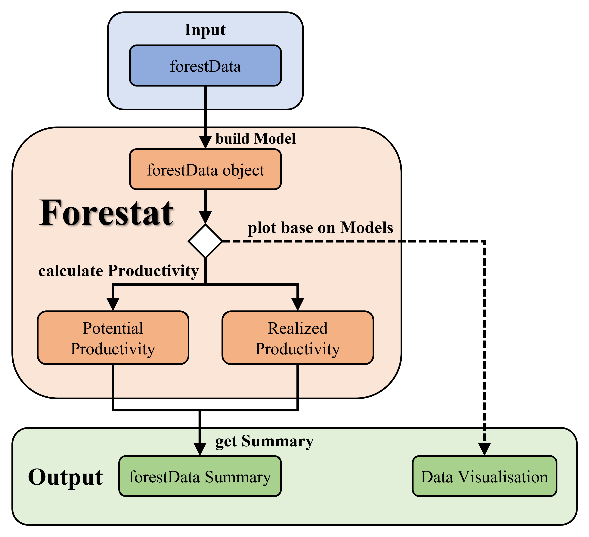
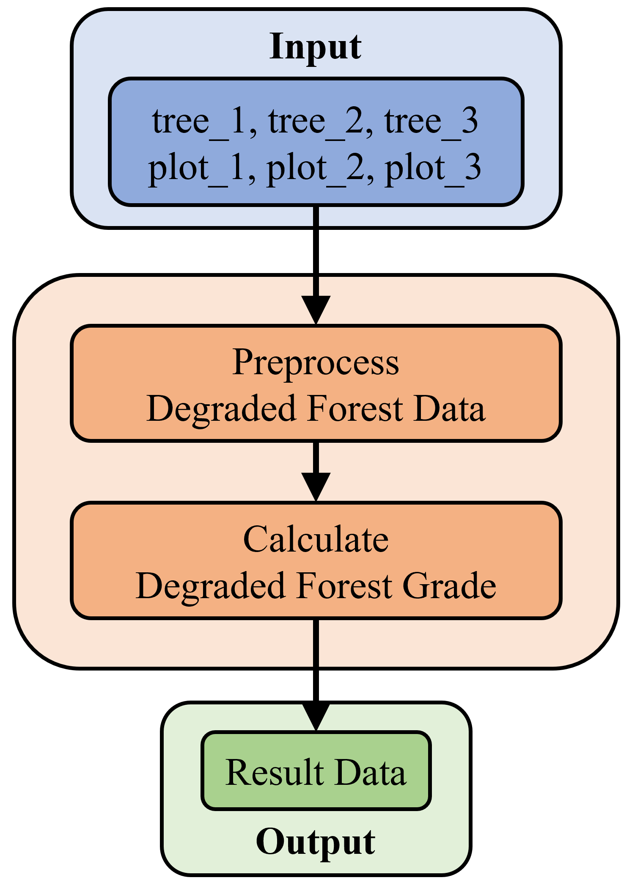
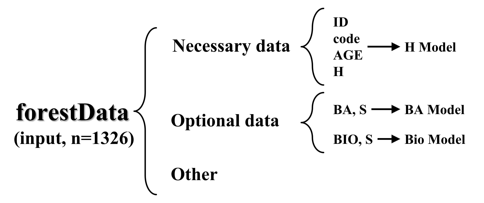
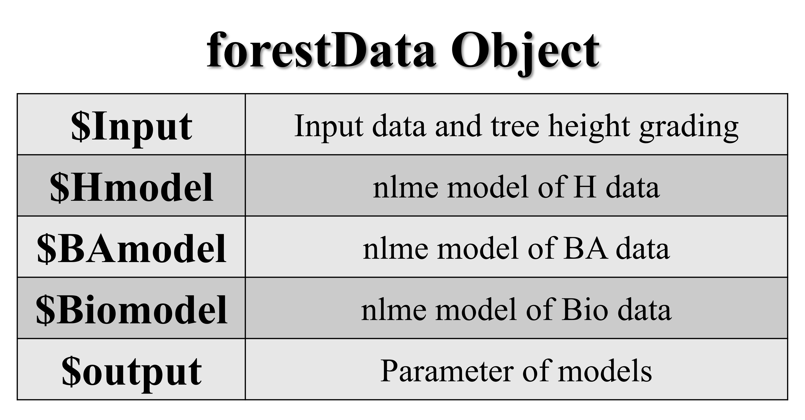
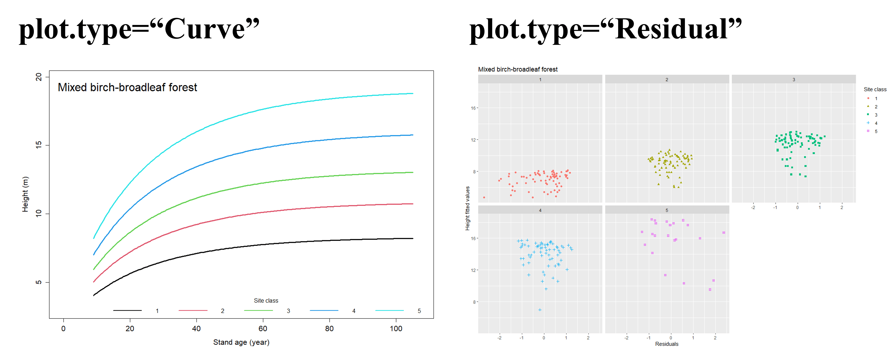
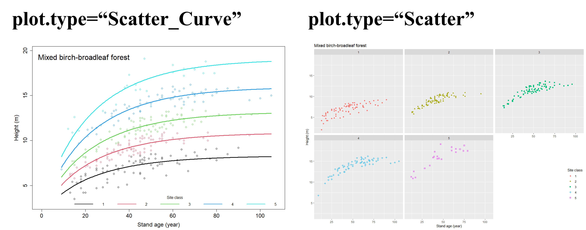

# <div align="center"><strong>森林碳汇计量和潜力计算</strong></div>

<p align="right"><strong>Forestat version:</strong> 1.1.0</p>
<p align="right"><strong>Date:</strong> 10/10/2023 </p>
<br>

*`forestat`* 是基于中国林业科学研究院资源信息研究所（Institute of Forest Resource Information Techniques, Chinese Academy of Forestry）提出的`基于林分潜在生长量的立地质量评价方法与应用`[<sup>[1]</sup>](#citation)和`A basal area increment-based approach of site productivity evaluation for multi-aged and mixed forests`[<sup>[2]</sup>](#citation)开发的R包。可依据林分高生长，划分立地等级；并以全林整体模型为基础，建立不同立地等级下的非线性混合效应生物量模型，实现更精准的碳汇计量；尤其提出了一种基于林分潜在生长量的碳汇潜力计算方法。该套算法适用于天然林和人工林，能够定量回答一定立地条件下的潜在生产力、现实生产力、提升空间有多大，可用于立地质量评价、树种适宜性评价、退化林评价等多个方面。

<div align="center">

[English](README.en-US.md) | [简体中文](README.md)
<br>

</div>

## <div align="center">1 概述</div>

*`forestat`* 包实现了碳汇潜力计算和退化林评价，其中碳汇潜力计算包括了基于林分高生长的立地等级划分，树高模型、断面积生长模型、生物量生长模型的建立，林分现实生产力与潜在生产力的计算。树高模型可用Richard模型、Logistic模型、korf模型、Gompertz模型、Weibull模型和Schumacher模型构建，断面积生长模型和生物量生长模型仅可用Richard模型构建。碳汇潜力计算依赖于给定林分类型（树种）的多个样地数据，退化林的评价依赖于多个样木和样地数据，*`forestat`* 包中带有一些样例数据。

### 1.1 *forestat* 流程图

<div align="center">
  
  <p>图 1.1 碳汇计算工作流程图</p>
</div>

<div align="center">
  
  <p>图 1.2 退化林评价工作流程图</p>
</div>

### 1.2 *forestat* 依赖的R包

| **Package** | **Download Link**                          |
| ----------- | ------------------------------------------ |
| dplyr       | https://CRAN.R-project.org/package=dplyr   |
| ggplot2     | https://CRAN.R-project.org/package=ggplot2 |
| nlme        | https://CRAN.R-project.org/package=nlme    |

## <div align="center">2 安装</div>

### 2.1 从CRAN或GitHub安装
在 R 中使用以下命令从 [CRAN](https://CRAN.R-project.org/package=forestat) 安装 *`forestat`*  ：

```R
# 安装forestat
install.packages("forestat")
```

当然，你也可以在 R 中使用以下命令从 [GitHub](https://github.com/caf-ifrit/forestat) 安装 *`forestat`*  ：

```R
# 安装devtools
install.packages("devtools")

# 安装forestat
devtools::install_github("caf-ifrit/forestat/forestat")
```

### 2.2 加载  *forestat*

```R
library(forestat)
```

## <div align="center">3 快速开始</div>

本部分展示的是快速完成立地分级、潜在生产力和现实生产力的完整步骤，使用的数据是包中自带的`forestData`样例数据。

```R
# 加载包中 forestData 样例数据
data("forestData")

# 基于 forestData 数据建立模型，返回一个 forestData 类对象
forestData <- class.plot(forestData, model = "Richards",
                         interval = 5, number = 5,
                         H_start=c(a=20,b=0.05,c=1.0))

# 绘制树高生长模型散点图
plot(forestData,model.type = "H",plot.type = "Scatter",
     title = "桦木阔叶树高生长模型散点图")

# 计算 forestData 对象的潜在生产力
forestData <- potential.productivity(forestData)

# 计算 forestData 对象的现实生产力
forestData <- realized.productivity(forestData)

# 获取 forestData 对象的汇总数据
summary(forestData)
```

本部分展示的是快速完成退化林评价的完整步骤，使用的数据是包中自带的`tree_1`、`tree_2`、 `tree_3`、`plot_1`、`plot_2`、`plot_3`样例数据。

```R
# 加载包中tree_1 tree_2 tree_3 plot_1 plot_2 plot_3样例数据
data(tree_1)
data(tree_2)
data(tree_3)
data(plot_1)
data(plot_2)
data(plot_3)

# 对退化林数据进行预处理
plot_data <- degraded_forest_preprocess(tree_1, tree_2, tree_3,
                                        plot_1, plot_2, plot_3)

# 计算退化林评价指标
res_data <- calc_degraded_forest_grade(plot_data)

# 查看计算结果
res_data
```

## <div align="center">4 碳汇潜力计算</div>

<details>
<summary style="font-size:21px;"><strong>4.1 建立模型</strong></summary>

<br>
<details>
<summary style="font-size:18px;"><strong>4.1.1 自定义数据</strong></summary>

为了建立一个准确的模型，好的数据是不可或缺的，在 *`forestat`* 包中内置了一个经过清洗的样例数据，可以通过如下命令加载查看样例数据：

```R
# 加载包中 forestData 样例数据
data("forestData")

# 筛选 forestData 样例数据中ID、code、AGE、H、S、BA 和 Bio字段
# 并查看前6行数据
head(dplyr::select(forestData,ID,code,AGE,H,S,BA,Bio))

# 输出
  ID code AGE   H         S       BA       Bio
1  1    1  13 2.0 152.67461 4.899382 32.671551
2  2    1  15 3.5  68.23825 1.387268  5.698105
3  3    1  20 4.2 128.32683 3.388492 22.631467
4  4    1  19 4.2 204.93928 4.375324 18.913886
5  5    1  13 4.2  95.69713 1.904063  6.511951
6  6    1  25 4.7 153.69393 4.129810 28.024739
```

当然，你也可以选择加载自定义数据：

```R
# 加载自定义数据
forestData <- read.csv("/path/to/your/folder/your_file.csv")
```

自定义数据中`ID（样地ID）`、`code（样地林分类型代码）`、`AGE（林分平均年龄）`、`H（林分平均高）`是必须字段，用以建立`树高模型（H-model）`，并绘制相关示例图。

`S（林分密度指数）`、`BA（林分断面积）`、`Bio（林分生物量）`是可选的字段，用以建立`断面积生长模型（BA-model）`与`生物量生长模型（Bio-model）`。

在后续的潜在生产力和现实生产力计算中，断面积生长模型与生物量生长模型是必须的。也就是自定义数据如果缺少`S`、`BA`和`Bio`字段将无法计算潜在生产力和现实生产力。

<div align="center">
  
  <p>图 2. 自定义数据格式要求</p>
</div>

</details>

<br>
<details>
<summary style="font-size:18px;"><strong>4.1.2 构建林分生长模型</strong></summary>
<div id="4.1.2"></div>

数据加载后，*`forestat`* 将使用`class.plot()`函数构建林分生长模型，如果自定义数据中同时包含`ID、code、AGE、H、S、BA、Bio`字段，则会同时构建`树高模型、断面积生长模型、生物量生长模型`，如果只包含`ID、code、AGE、H`字段，则只会构建`树高模型`。

```R
# 选用 Richards 模型构建林分生长模型
# interval=5表示初始树高分类的林分年龄区间设置为5，number=5表示初始树高分类数最多为5，maxiter=1000表示拟合模型的最大次数为1000
# 树高模型拟合的初始参数H_start默认为c(a=20,b=0.05,c=1.0)
# 断面积生长模型拟合的初始参数BA_start默认为c(a=80, b=0.0001, c=8, d=0.1)
# 生物量生长模型拟合的初始参数Bio_start默认为c(a=450, b=0.0001, c=12, d=0.1)
forestData <- class.plot(forestData, model = "Richards",
                         interval = 5, number = 5, maxiter=1000,
                         H_start=c(a=20,b=0.05,c=1.0),
                         BA_start = c(a=80, b=0.0001, c=8, d=0.1),
                         Bio_start=c(a=450, b=0.0001, c=12, d=0.1))
```

其中，`model`为构建树高模型时选用的模型，可在`"Logistic"、"Richards"、"Korf"、"Gompertz"、"Weibull"、"Schumacher"`模型中任选一个，断面积生长模型和生物量生长模型默认使用Richard模型构建。`interval`为初始树高分类的林分年龄区间，number为初始树高分类数的最大值，`maxiter`为最大拟合次数。`H_start` 是拟合树高模型的初始参数，`BA_start` 是拟合断面积生长模型的初始参数，`H_start` 是拟合生物量生长模型的初始参数，当拟合出现错误时，可以多尝试一些初始参数作为尝试。

由`class.plot()`函数返回的结果为`forestData` 对象，包括`Input`（输入数据和树高分级结果）、`Hmodel`（树高模型结果）、`BAmodel`（断面积模型结果）、`Biomodel`（生物量模型结果）以及`output`（所有模型的表达式、参数及精度）。

<div align="center">
  
  <p>图 3. forestData对象结构</p>
</div>

</details>

<br>
<details>
<summary style="font-size:18px;"><strong>4.1.3 获取汇总数据</strong></summary>
<div id="4.1.3"></div>

为了解模型的建立情况，可以使用`summary(forestData)`函数获取`forestData`对象汇总数据。该函数返回`summary.forestData`对象并将相关数据输出至屏幕。

输出的第一段为输入数据的汇总，第二、三、四段分别为`H-model`、`BA-model`、`Bio-model`的参数及其精简报告。

```R
summary(forestData)
```

```R
# 输出
# 第一段
       H               S                 BA              Bio         
 Min.   : 2.00   Min.   :  68.24   Min.   : 1.387   Min.   :  5.698  
 1st Qu.: 8.10   1st Qu.: 366.37   1st Qu.: 9.641   1st Qu.: 52.326  
 Median :10.30   Median : 494.76   Median :13.667   Median : 78.502  
 Mean   :10.62   Mean   : 522.53   Mean   :14.516   Mean   : 90.229  
 3rd Qu.:12.90   3rd Qu.: 661.84   3rd Qu.:18.750   3rd Qu.:115.636  
 Max.   :19.10   Max.   :1540.13   Max.   :45.749   Max.   :344.412  

# 第二段
H-model Parameters:
Nonlinear mixed-effects model fit by maximum likelihood
  Model: H ~ 1.3 + a * (1 - exp(-b * AGE))^c 
  Data: data 
       AIC      BIC    logLik
  728.4366 747.2782 -359.2183

Random effects:
 Formula: a ~ 1 | LASTGROUP
               a  Residual
StdDev: 3.767163 0.7035752

Fixed effects:  a + b + c ~ 1 
      Value Std.Error  DF  t-value p-value
a 12.185054 1.7050081 313 7.146625       0
b  0.037840 0.0043682 313 8.662536       0
c  0.761367 0.0769441 313 9.895060       0
 Correlation: 
  a      b     
b -0.110       
c -0.093  0.946

Standardized Within-Group Residuals:
         Min           Q1          Med           Q3          Max 
-3.858592084 -0.719253472  0.007120413  0.761123585  3.375793806 

Number of Observations: 320
Number of Groups: 5 

Concise Parameter Report:
Model Coefficients:
       a1       a2       a3       a4       a5          b         c
 7.013778 9.575677 11.90324 14.67456 17.75801 0.03783956 0.7613666

Model Evaluations:
           pe      RMSE        R2       Var       TRE      AIC      BIC    logLik
 -0.006484677 0.6980625 0.9543312 0.4887767 0.3960163 728.4366 747.2782 -359.2183

Model Formulas:
                                       Func                  Spe
 model1:H ~ 1.3 + a * (1 - exp(-b * AGE))^c model1:pdDiag(a ~ 1)

# 第三段（与第二段数据格式相似）
BA-model Parameters:

# 此处省略
......

# 第四段（与第二段数据格式相似）
Bio-model Parameters:

# 此处省略
......
```

</details>
</details>

<br>
<details>
<summary style="font-size:21px;"><strong>4.2 绘制图像</strong></summary>

经过[4.1.2](#4.1.2) `class.plot()`函数构建林分生长模型后，就可以使用`plot()`函数绘制图像。

其中，`model.type`为绘图使用的模型，可以选择`H`（树高模型）、`BA`（断面积生长模型）或者`Bio`（生物量生长模型）。`plot.type`为绘图的类型，可以选择`Curve`（曲线图）、`Residual`（残差图）、`Scatter_Curve`（散点曲线图）、`Scatter`（散点图）。`xlab`、`ylab`、`legend.lab`、`title`分别为`x轴标题`、`y轴标题`、`图例`、`图像标题`。

```R
# 绘制树高模型的曲线图
plot(forestData,model.type="H",
     plot.type="Curve",
     xlab="年龄(year)",ylab="树高(m)",legend.lab="立地等级",
     title="桦木阔叶混树高模型曲线图")

# 绘制断面积生长模型散点图
plot(forestData,model.type="BA",
     plot.type="Scatter",
     xlab="年龄(year)",ylab=expression(paste("断面积( ",m^2,"/",hm^2,")")),legend.lab="立地等级",
     title="桦木阔叶混断面积生长模型散点图")
```

不同的`plot.type`绘制的样图如图4所示：

<div align="center">
  
  
  <p>图 4. 不同的plot.type绘制的样图</p>
</div>

</details>

<br>
<details>
<summary style="font-size:21px;"><strong>4.3 计算林分潜在生产力</strong></summary>

经过[4.1.2](#4.1.2) `class.plot()`函数构建林分生长模型后，就可以使用`potential.productivity()`函数计算林分潜在生产力。在计算之前，要求`forestData` 对象中`BA-model`和`Bio-model`已经建立。

```R
forestData <- potential.productivity(forestData, code=1,
                                     age.min=5,age.max=150,
                                     left=0.05, right=100,
                                     e=1e-05, maxiter = 50) 
```

其中，参数`code`为计算潜在生产力使用的林分类型代码。`age.min`和`age.max`分别为林分年龄的最小值和最大值，潜在生产力的计算会在最小值和最大值的区间中进行。`left`和`right`为拟合模型的初始参数，当拟合出现错误时，可以多尝试一些初始参数作为尝试。`e`为拟合模型的精度，当残差低于`e`时，认为模型收敛并停止拟合。`maxiter`为拟合模型的最大次数，当拟合次数等于`maxiter`时，认为模型收敛并停止拟合。

<br>
<details>
<summary style="font-size:18px;"><strong>4.3.1 潜在生产力输出数据说明</strong></summary>

计算结束后，可以使用如下命令查看并输出结果：

```R
library(dplyr)
forestData$potential.productivity %>% head(.)
```

```R
# 输出
    Max_GI   Max_MI       N1       D1       S0       S1       G0       G1       M0       M1 LASTGROUP AGE
1 3.949820 20.47488 9830.149 6.945724 1645.486 1800.378 33.29664 37.24646 119.5148 139.9897         1   5
2 3.348912 17.90140 8823.972 7.294578 1619.740 1748.342 33.52799 36.87690 125.2417 143.1431         1   6
3 2.906982 15.94796 8044.876 7.609892 1596.350 1705.999 33.68334 36.59033 130.1117 146.0597         1   7
4 2.568525 14.40953 7418.938 7.898755 1574.827 1670.207 33.78520 36.35373 134.3302 148.7398         1   8
5 2.300998 13.16340 6902.612 8.166065 1554.965 1639.234 33.85073 36.15173 138.0482 151.2116         1   9
6 2.084278 12.13145 6467.402 8.415423 1536.461 1611.846 33.88831 35.97259 141.3594 153.4908         1  10
```

输出结果中，各字段含义如下：

`Max_GI`：林分断面积最大年生长量

`Max_MI`：林分生物量最大年生长量

`N1`：达到潜在生长量对应的林分株数

`D1`：达到潜在生长量对应的林分平均直径

`S0`： 初始林分密度指数

`S1`：达到潜在生长量对应的最佳林分密度指数

G0：初始林分每公顷断面积

`G1`：达到潜在生长量对应的林分每公顷断面积(1年以后)

`M0`：初始林分每公顷生物量

`M1`：达到潜在生长量对应的林分每公顷生物量

</details>
</details>

<br>
<details>
<summary style="font-size:20px;"><strong>4.4 计算林分现实生产力</strong></summary>

经过[4.1.2](#4.1.2) `class.plot()`函数构建林分生长模型后，可以使用`realized.productivity()`函数计算林分现实生产力。在计算之前，要求`forestData` 对象中`BA model`和`Bio model`已经建立。

```R
forestData <- realized.productivity(forestData, 
                                   left=0.05, right=100)
```

其中，参数`left`与`right`是拟合模型的初始参数，当拟合出现错误时，可以多尝试一些初始参数作为尝试。

<br>
<details>
<summary style="font-size:18px;"><strong>4.4.1 现实生产力输出数据说明</strong></summary>

计算结束后，可以使用如下命令查看并输出结果：

```R
library(dplyr)
forestData$realized.productivity %>% head(.)
```

```R
# 输出
  code ID AGE   H class0 LASTGROUP       BA         S       Bio        BAI        VI
1    1  1  13 2.0      1         1 4.899382 152.67461 32.671551 0.18702090 1.0034425
2    1  2  15 3.5      1         1 1.387268  68.23825  5.698105 0.07181113 0.3804467
3    1  3  20 4.2      1         1 3.388492 128.32683 22.631467 0.10764262 0.6294930
4    1  4  19 4.2      1         1 4.375324 204.93928 18.913886 0.18279397 1.0839852
5    1  5  13 4.2      2         1 1.904063  95.69713  6.511951 0.11526498 0.6028645
6    1  6  25 4.7      1         1 4.129810 153.69393 28.024739 0.10696539 0.6640617
```

输出结果中，各字段含义如下：

`BAI`：断面积现实生产力

`VI`：生物量现实生产力

</details>
</details>

<br>
<details>
<summary style="font-size:20px;"><strong>4.5 潜在生产力和现实生产力数据详情</strong></summary>

在得到林分潜在生产力与现实生产力后，可以使用`summary(forestData)`函数获取`forestData`对象汇总数据。该函数返回`summary.forestData`对象并将相关数据输出至屏幕。

输出的前四段在[4.1.3](#4.1.3)中已经介绍，第五段为潜在生产力与现实生产力数据详情。

```R
summary(forestData)
```

```R
# 输出
# 第一段
       H               S                 BA              Bio         
 Min.   : 2.00   Min.   :  68.24   Min.   : 1.387   Min.   :  5.698  
 
# 此处省略
......

# 第五段
     Max_GI           Max_MI      
 Min.   :0.1446   Min.   : 1.216  
 1st Qu.:0.2046   1st Qu.: 1.813  
 Median :0.3023   Median : 2.562  
 Mean   :0.5477   Mean   : 4.029  
 3rd Qu.:0.5702   3rd Qu.: 4.446  
 Max.   :4.4483   Max.   :26.961  

      BAI                VI        
 Min.   :0.06481   Min.   :0.3804  
 1st Qu.:0.16296   1st Qu.:1.3086  
 Median :0.22507   Median :1.8154  
 Mean   :0.25199   Mean   :1.9743  
 3rd Qu.:0.30246   3rd Qu.:2.4227  
 Max.   :0.98168   Max.   :6.6287 
```

</details>

## <div align="center">5 退化林评价</div>

<details>
<summary style="font-size:21px;"><strong>5.1 数据要求</strong></summary>

在 *`forestat`* 包中内置了样例数据，包括了`tree_1`、`tree_2`、`tree_3`三个样木数据以及`plot_1`、`plot_2`、`plot_3`三个样地数据，可以通过如下命令加载查看样例数据：

```R
# 加载包中tree_1 tree_2 tree_3 plot_1 plot_2 plot_3样例数据
# tree_1 plot_1, tree_2 plot_2, tree_3 plot_3 分别为2005年、2010年、2015年清查数据
data(tree_1)
data(tree_2)
data(tree_3)
data(plot_1)
data(plot_2)
data(plot_3)

# 查看tree_1前6行数据
head(tree_1)

# 输出
  tree_number sample_plot_number inspection_type tree_species_code   plot_id
1           3                  4              11               410 700000004
2          13                  4              14               410 700000004
3          19                  4              11               420 700000004
4          26                  4              12               420 700000004
5          28                  4              12               420 700000004
6          29                  4              12               410 700000004

# 查看plot_1前6行数据
head(plot_1)

# 输出
  sample_plot_number sample_plot_type altitudes slope_direction slope_position gradient soil_thickness humus_thickness
1                  2               11       410               9              6        0             60               0
2                  5               11       333               3              3        4             30              10
3                  6               11       350               2              5        1             70              20
4                  7               11       395               2              3        5             75              20
5                  8               11       438               2              4        4             80              20
6                  9               11       472               7              4        5             60              25
  land_type origin dominant_tree_species average_age age_group average_diameter_at_breast_height average_tree_height
1       180      0                     0           0         0                                 0                   0
2       111     13                   620          37         2                               125                 116
3       240      0                     0           0         0                                 0                   0
4       111     13                   620          20         1                                97                 110
5       111     11                   620          75         4                               195                  97
6       111     13                   630          35         2                               120                  89
  crown_density naturalness disaster_type disaster_level standing_stock dead_wood_stock forest_cutting_stock   plot_id
1             0           0             0              0          0.000           0.000                0.000 700000002
2            85           4            20              1          4.816           0.131                0.000 700000005
3             0           0             0              0          0.000           0.000                0.000 700000006
4            60           4             0              0          1.560           0.082                0.040 700000007
5            50           4            20              1          3.665           0.464                0.013 700000008
6            60           4            20              1          4.890           0.041                1.408 700000009
```

样例数据中各字段含义如下：

`tree_number`: 样木号

`sample_plot_number`: 样地号

`inspection_type`：检尺类型

`tree_species_code`：树种代码

`plot_id`：样地ID

`sample_plot_type`: 样地类型

`altitudes`：海拔

`slope_direction`：坡向

`slope_position`：坡位

`gradient`：坡度

`soil_thickness`：土壤厚度

`humus_thickness`：腐殖质厚度

`land_type`：地类

`origin`：起源

`dominant_tree_species`：优势树种

`average_age`：平均年龄

`age_group`：龄组

`average_diameter_at_breast_height`：平均胸径

`average_tree_height`：平均树高

`crown_density`：郁闭度

`naturalness`：自然度

`disaster_type`：灾害类型

`disaster_level`：灾害等级

`standing_stock`：活立蓄积

`dead_wood_stock`：枯损蓄积

`forest_cutting_stock`：采伐蓄积

你也可以加载自定义数据，自定义数据中tree_1、tree_2、tree_3 必须包含字段`plot_id`、`inspection_type`和`tree_species_code`。plot_1、plot_2和plot_3必须包含字段`plot_id`、`stand_stock`、`forest_cutting_stock`、`crown_density`、`disaster_level`、`origin`、`dominant_tree_species`、`age_group`、`naturalness`和`land_type`。

```R
# 加载openxlsx包
library("openxlsx")

# 从xlsx中加载自定义数据tree_1 tree_2 tree_3 plot_1 plot_2 plot_3
tree_1 <- read.xlsx("/path/to/your/folder/tree_1.xlsx", sheet = 1)
tree_2 ...
...
```

</details>

<br>
<details>
<summary style="font-size:20px;"><strong>5.2 退化林等级计算</strong></summary>

在加载数据后，可以使用`degraded_forest_preprocess()`函数完成退化林数据预处理，使用`calc_degraded_forest_grade()`函数完成退化林等级计算。

```R
# 退化林数据预处理
plot_data <- degraded_forest_preprocess(tree_1, tree_2, tree_3,
                                        plot_1, plot_2, plot_3)

# 退化林等级计算
res_data <- calc_degraded_forest_grade(plot_data)

# 查看计算结果
res_data
```

`res_data`中包括了p1、p2、p3、p4、p5、ID、referenceID、num、p1m、p2m、p3m、p4m、Z1、Z2、Z3、Z4、Z5、Z、Z_weights、Z_grade、Z_weights_grade等字段，含义如下：

`p1`：蓄积平均净增长率

`p2`：进界率

`p3`：树种减少率

`p4`：林分郁闭度减少率

`p5`：森林灾害等级

`ID`：分组ID，按照`起源-优势数种-龄组`分组

`referenceID`：参照对象ID

`num`：参照对象数量

`p1m`：蓄积平均净增长率的参照值

`p2m`：进界率的参照值

`p3m`：树种减少率的参照值

`p4m`：林分郁闭度减少率的参照值

`Z1`：判别因子Z1

`Z2`：判别因子Z2

`Z3`：判别因子Z3

`Z4`：判别因子Z4

`Z5`：判别因子Z5

`Z`：判别因子之和，$Z = Z1 + Z2 + Z3 + Z4 + Z5$

`Z_weights`：综合判别因子，判别因子权重之和 $Z_weights = Z1 + 0.75 \times Z2 + 0.5 \times Z3 + 0.5 \times Z4 + 0.25 \times Z5$

`Z_grade`：Z 对应的退化林等级

`Z_weights_grade`：Z_weights 对应的退化林等级

</details>

## <div align="center">6 引用</div>

<div id="citation"></div>

```txt
[1] 雷相东, 符利勇, 李海奎等. 基于林分潜在生长量的立地质量评价方法与应用[J]. 林业科学, 2018, 54(12): 116-126.
[2] Fu L, Sharma R P, Zhu G, et al. A basal area increment-based approach of site productivity evaluation for multi-aged and mixed forests[J]. Forests, 2017, 8(4): 119.
```
